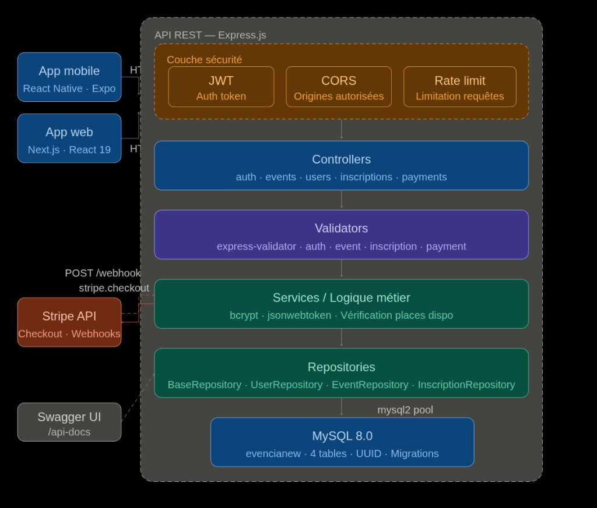

# Épreuve E6 — Projet Evencia

> Fiches descriptives de réalisation professionnelle (Annexe 9-1-B) adaptées au projet **Evencia** pour l'épreuve E6 du BTS SIO option SLAM — Session 2026.

---

# Partie 1 : Application Web

---

## ANNEXE 9-1-B : Fiche descriptive de réalisation professionnelle (recto)

### Épreuve E6 — Conception et développement d'applications (option SLAM)

| Champ | Valeur |
|-------|--------|
| **N° réalisation** | 1 |
| **Nom, prénom** | *(à compléter)* |
| **N° candidat** | *(à compléter)* |
| **Épreuve** | ☑ Épreuve ponctuelle / ☐ Contrôle en cours de formation |
| **Date** | ...... / ...... / ............ |

---

### Organisation support de la réalisation professionnelle

*(à compléter — nom de l'établissement ou de l'entreprise de stage)*

---

### Intitulé de la réalisation professionnelle

**Conception et développement d'une application web fullstack dédiée à la gestion d'événements avec paiement en ligne**

---

### Période et lieu

| Champ | Valeur |
|-------|--------|
| **Période de réalisation** | *(à compléter, ex : Septembre 2024 – Juin 2025)* |
| **Lieu** | *(à compléter)* |

---

### Modalité

☑ Seul(e) — ☐ En équipe

---

### Compétences travaillées

| Compétence | Travaillée |
|------------|:----------:|
| Concevoir et développer une solution applicative | ☑ |
| Assurer la maintenance corrective ou évolutive d'une solution applicative | ☑ |
| Gérer les données | ☑ |

---

### Conditions de réalisation (ressources fournies, résultats attendus)

**Ressources fournies :**
- Cahier des charges fonctionnel, architecture applicative

**Résultats attendus :**
- Architecture applicative détaillée, API REST fonctionnelle et frontend web fonctionnel

**L'application doit permettre :**
- La gestion d'événements culturels (CRUD complet pour les organisateurs et administrateurs)
- La gestion des utilisateurs multi-rôles (inscription, connexion, profil)
- L'inscription et le paiement en ligne (Stripe) pour les participants
- Un tableau de bord organisateur avec suivi des inscriptions

---

### Description des ressources documentaires, matérielles et logicielles utilisées

**Ressources documentaires**
- Cahier des charges
- Documentation officielle de Express.js, Next.js, Drizzle ORM, Stripe
- Documentation Swagger / OpenAPI 3

**Ressources matérielles**
- Ordinateur personnel (Arch Linux)

**Outils et ressources logicielles**

- Backend API REST : IDE : Cursor (VS Code), Runtime : Node.js 20, Framework : Express.js 4.18, ORM : Drizzle ORM 0.44 + mysql2 3.15, Authentification : jsonwebtoken 9.0 (JWT) + bcrypt 5.1, Validation : express-validator 6.15, Sécurité : express-rate-limit 8.2 + CORS, Paiement : Stripe 12.0, Documentation : swagger-jsdoc 6.2 + swagger-ui-express 5.0, Base de données : MySQL 8.0
- Frontend : IDE : Cursor (VS Code), Framework : Next.js 16.0 (React 19.2, TypeScript 5), Styles : Tailwind CSS 4, État : Zustand 5.0, Animations : Framer Motion 12.23, Client HTTP : Axios 1.13, Icônes : Lucide React 0.556, Paiement : @stripe/stripe-js 8.5
- Conteneurisation : Docker, Docker Compose (MySQL + Backend + Frontend)
- Versioning : Git, GitHub
- Déploiement : Oracle Cloud (VPS ARM), Nginx (reverse proxy), Certbot (HTTPS), DuckDNS

---

### Modalités d'accès aux productions et à leur documentation

Le code source est accessible sur GitHub : https://github.com/Noblesse18/evencia

Le fichier `README.md` à la racine contient les instructions d'installation et de lancement.

La documentation technique et utilisateur est disponible dans le dossier `/docs` du dépôt :
- `docs/documentation-technique.md` — Architecture, schéma BDD, endpoints API, sécurité
- `docs/documentation-utilisateur.md` — Guide d'utilisation avec captures d'écran
- `docs/evencia-postman-collection.json` — Collection de tests API Postman (importable)

**Lancement du projet :**
```
git clone https://github.com/Noblesse18/evencia.git
cd evencia
docker compose up --build -d
```

**Accès à l'application :**

| Service | URL |
|---------|-----|
| Frontend Web | http://localhost:3000 |
| Backend API | http://localhost:5000/api |
| Documentation Swagger | http://localhost:5000/api-docs |

**Identifiants de test :**

| Rôle | Email | Mot de passe |
|------|-------|-------------|
| Organisateur | comaravel@gmail.com | *(défini dans le seed)* |
| Participant | *(créer via /register)* | — |

**Carte de test Stripe** : `4242 4242 4242 4242` (date future quelconque, CVC quelconque)

---

---

## ANNEXE 9-1-B : Fiche descriptive de réalisation professionnelle (verso)

### Épreuve E6 — Conception et développement d'applications (option SLAM)

### Descriptif de la réalisation professionnelle, y compris les productions réalisées et schémas explicatifs

---

Dans le cadre du BTS SIO option SLAM, j'ai développé **Evencia**, une application web fullstack de gestion d'événements. L'objectif était de concevoir un back-end complet (API REST) intégrant authentification sécurisée, gestion des rôles, paiement en ligne et documentation interactive, ainsi qu'un front-end moderne et responsive.

L'application gère trois rôles distincts :
- **Participant** : inscription, connexion, consultation des événements, inscription/paiement Stripe, modification du profil
- **Organisateur** : CRUD complet sur ses événements, tableau de bord avec suivi des inscriptions
- **Administrateur** : gestion de tous les utilisateurs et événements

---

#### Architecture de l'application

L'application repose sur une architecture en couches bien séparée, avec un **backend** (API REST) et un **frontend** (application web) découplés.

---

##### Architecture Backend — API REST Express.js

Le diagramme ci-dessous illustre l'architecture en couches du backend, depuis la couche sécurité jusqu'à la base de données :



L'API REST est structurée en couches :
- **Couche sécurité** : JWT (authentification par token), CORS (origines autorisées), Rate Limit (limitation des requêtes)
- **Controllers** : auth, events, users, inscriptions, payments — orchestrent les requêtes entrantes
- **Validators** : express-validator — valident les données reçues (auth, event, inscription, payment)
- **Services / Logique métier** : bcrypt (hashage), jsonwebtoken (génération JWT), vérification des places disponibles
- **Repositories** : BaseRepository, UserRepository, EventRepository, InscriptionRepository — accès aux données via mysql2 pool
- **Base de données** : MySQL 8.0 (base `evencianew`, 4 tables, clés UUID, migrations SQL)
- **Services externes** : Stripe API (Checkout + Webhooks), Swagger UI (`/api-docs`)

---

##### Architecture Frontend — Application Web Next.js

```
┌──────────────────────────────────────────────────────────────┐
│              Application Web — Next.js 16 (React 19)          │
│                                                              │
│  ┌────────────────────────────────────────────────────────┐  │
│  │                    Pages (App Router)                   │  │
│  │  /              Page d'accueil                          │  │
│  │  /events        Liste des événements (filtres, pagination)│
│  │  /events/[id]   Détail d'un événement + paiement Stripe│  │
│  │  /dashboard     Tableau de bord organisateur            │  │
│  │  /profile       Profil utilisateur                      │  │
│  │  /auth/login    Connexion                               │  │
│  │  /auth/register Inscription                             │  │
│  └──────────────────────┬─────────────────────────────────┘  │
│                          │                                    │
│  ┌──────────────────────┴─────────────────────────────────┐  │
│  │                  Components Layer                       │  │
│  │  Navbar · EventCard · FilterBar · Footer                │  │
│  │  ProtectedRoute · DashboardStats                        │  │
│  └──────────────────────┬─────────────────────────────────┘  │
│                          │                                    │
│  ┌──────────────────────┴─────────────────────────────────┐  │
│  │                  State Management                       │  │
│  │  Zustand 5 (store global avec persistance localStorage) │  │
│  │  Auth state · Events state                              │  │
│  └──────────────────────┬─────────────────────────────────┘  │
│                          │                                    │
│  ┌──────────────────────┴─────────────────────────────────┐  │
│  │                  API / HTTP Layer                        │  │
│  │  Axios (baseURL: /api) + Intercepteur JWT               │  │
│  │  Déconnexion automatique sur erreur 401                  │  │
│  └──────────────────────┬─────────────────────────────────┘  │
│                          │                                    │
│  ┌──────────────────────┴─────────────────────────────────┐  │
│  │                  Style & UI Layer                        │  │
│  │  Tailwind CSS 4 · Framer Motion 12 (animations)         │  │
│  │  Lucide React (icônes) · @stripe/stripe-js (paiement)   │  │
│  └────────────────────────────────────────────────────────┘  │
└──────────────────────────┬───────────────────────────────────┘
                           │ HTTP / REST (JSON)
                           ▼
              ┌─────────────────────────┐
              │   API Express.js        │
              │   Port 5000             │
              └─────────────────────────┘
```

---

#### Diagramme de classes (MLD)

Ce diagramme modélise la structure statique de la base de données avec les entités principales :

```
┌────────────────────────┐       ┌──────────────────────────────┐
│        users           │       │          events              │
├────────────────────────┤       ├──────────────────────────────┤
│ id        VARCHAR(36)  │ PK    │ id          VARCHAR(36)  PK  │
│ name      VARCHAR(100) │       │ title       VARCHAR(200)     │
│ email     VARCHAR(100) │ UK    │ description TEXT             │
│ password  VARCHAR(255) │       │ category    VARCHAR(100)     │
│ role      ENUM         │       │ location    VARCHAR(200)     │
│  (participant,         │       │ event_date  DATETIME         │
│   organizer, admin)    │       │ price       DECIMAL(10,2)    │
│ created_at TIMESTAMP   │◄──────│ organizer_id VARCHAR(36) FK  │
│ updated_at TIMESTAMP   │       │ max_tickets INT              │
│ last_login TIMESTAMP   │       │ image_url   VARCHAR(500)     │
└──────────┬─────────────┘       │ photos      JSON             │
           │                     └─────────────┬────────────────┘
           │                                   │
           │    ┌─────────────────────────┐    │
           │    │     inscriptions        │    │
           │    ├─────────────────────────┤    │
           │    │ id       VARCHAR(36) PK │    │
           └───►│ user_id  VARCHAR(36) FK │    │
                │ event_id VARCHAR(36) FK │◄───┘
                │ status   ENUM          │
                │  (pending, confirmed,  │
                │   cancelled)           │
                │ UNIQUE(user_id,        │
                │        event_id)       │
                └────────────────────────┘

           ┌──────────────────────────────┐
           │         payments             │
           ├──────────────────────────────┤
           │ id                VARCHAR(36)│
           │ user_id           VARCHAR(36)│ FK → users
           │ event_id          VARCHAR(36)│ FK → events
           │ amount            DECIMAL    │
           │ status            VARCHAR    │
           │ stripe_payment_intent_id     │
           │ stripe_customer_id           │
           │ payment_method    VARCHAR    │
           │ card_last4        VARCHAR(4) │
           │ card_brand        VARCHAR    │
           └──────────────────────────────┘
```

**Relations :**
- `users` 1 → N `events` (un organisateur crée plusieurs événements)
- `users` 1 → N `inscriptions` (un utilisateur s'inscrit à plusieurs événements)
- `events` 1 → N `inscriptions` (un événement a plusieurs inscrits)
- `users` / `events` → N `payments` (un paiement lie un utilisateur à un événement)

---

#### Diagramme de cas d'utilisation

Ce diagramme illustre les interactions entre les acteurs (Participant, Organisateur, Administrateur) et le système Evencia :

```
┌───────────────────────────────────────────────────────────────┐
│                    Système Evencia (Web)                       │
│                                                               │
│  ┌────────────────────┐     ┌──────────────────────────────┐  │
│  │ S'inscrire         │     │ Créer un événement           │  │
│  │ (register)         │     │ (titre, date, lieu, prix,    │  │
│  └────────┬───────────┘     │  catégorie, places max)      │  │
│           │                 └──────────────┬───────────────┘  │
│  ┌────────┴───────────┐     ┌──────────────┴───────────────┐  │
│  │ Se connecter       │     │ Modifier un événement        │  │
│  │ (JWT)              │     └──────────────┬───────────────┘  │
│  └────────┬───────────┘     ┌──────────────┴───────────────┐  │
│           │                 │ Supprimer un événement       │  │
│  ┌────────┴───────────┐     └──────────────┬───────────────┘  │
│  │ Voir les événements│     ┌──────────────┴───────────────┐  │
│  │ (filtres, recherche│     │ Dashboard organisateur       │  │
│  │  pagination)       │     │ (stats inscriptions)         │  │
│  └────────┬───────────┘     └──────────────────────────────┘  │
│           │                                                   │
│  ┌────────┴───────────┐     ┌──────────────────────────────┐  │
│  │ S'inscrire à un    │     │ Gérer les utilisateurs       │  │
│  │ événement          │     │ (liste, rôles)               │  │
│  └────────┬───────────┘     └──────────────┬───────────────┘  │
│  ┌────────┴───────────┐                    │                  │
│  │ Payer (Stripe      │                    │                  │
│  │ Checkout)          │                    │                  │
│  └────────┬───────────┘                    │                  │
│  ┌────────┴───────────┐                    │                  │
│  │ Annuler inscription│                    │                  │
│  └────────┬───────────┘                    │                  │
│  ┌────────┴───────────┐                    │                  │
│  │ Modifier son profil│                    │                  │
│  │ Changer mot de passe                    │                  │
│  └────────────────────┘                    │                  │
│           │                                │                  │
└───────────┼────────────────────────────────┼──────────────────┘
            │                                │
      ┌─────┴──────┐               ┌─────────┴────────┐
      │ Participant │               │ Organisateur /   │
      └────────────┘               │ Administrateur   │
                                   └──────────────────┘
```

---

#### Documentation Swagger de l'API

La documentation Swagger de l'API du projet expose les endpoints REST disponibles sur http://localhost:5000/api-docs. On y retrouve les routes organisées par contrôleur :

- **auth-controller** : inscription, connexion, vérification token, changement de mot de passe
- **event-controller** : CRUD événements avec filtres et pagination
- **user-controller** : profil utilisateur, liste admin
- **inscription-controller** : inscription/désinscription aux événements
- **payment-controller** : création de session Stripe Checkout, webhook de confirmation

Le bouton **Authorize** permet de saisir le token JWT (`Bearer <token>`) pour tester les endpoints protégés directement depuis l'interface Swagger.

---

#### Interface utilisateur — Frontend Next.js

L'interface web correspond à une application Next.js 16 moderne avec :

- **Page d'accueil** (`/`) : présentation de la plateforme, événements mis en avant
- **Page événements** (`/events`) : liste dynamique avec filtres (catégorie, date, prix, ville) et pagination, récupérés depuis l'API via Axios
- **Détail événement** (`/events/[id]`) : informations complètes, bouton d'inscription et paiement Stripe
- **Dashboard** (`/dashboard`) : tableau de bord organisateur avec statistiques d'inscriptions
- **Profil** (`/profile`) : consultation et modification des informations personnelles

L'interface est stylée avec **Tailwind CSS 4**, animée avec **Framer Motion**, et l'état global est géré par **Zustand** avec persistance dans le localStorage.

---

#### Sécurité

| Mesure | Implémentation |
|--------|---------------|
| Hashage des mots de passe | bcrypt avec salt factor 10 |
| Authentification | JWT avec expiration 7 jours |
| Autorisation par rôles | Middleware `authorizeRoles('participant', 'organizer', 'admin')` |
| Validation des entrées | express-validator (email, longueur, regex) |
| Protection brute force | express-rate-limit (100 req/min global, 5 req/min sur `/auth`) |
| CORS | Origines restreintes via variable `CORS_ORIGINS` |
| Interception token expiré | Intercepteur Axios côté frontend (déconnexion auto sur 401) |

---

#### Conteneurisation Docker

L'application est orchestrée via Docker Compose avec 3 services :
- **MySQL 8.0** : base de données avec migrations SQL automatiques et volume persistant
- **Backend Express** : Node.js 20 Alpine, port 5000, healthcheck sur MySQL
- **Frontend Next.js** : build multi-stage optimisé, port 3000

Un fichier `docker-compose.prod.yml` existe pour le déploiement en production avec Nginx (reverse proxy) et Certbot (certificat HTTPS Let's Encrypt) sur un VPS Oracle Cloud.

---

---

---

# Partie 2 : Application Mobile

---

## ANNEXE 9-1-B : Fiche descriptive de réalisation professionnelle (recto)

### Épreuve E6 — Conception et développement d'applications (option SLAM)

| Champ | Valeur |
|-------|--------|
| **N° réalisation** | 2 |
| **Nom, prénom** | *(à compléter)* |
| **N° candidat** | *(à compléter)* |
| **Épreuve** | ☑ Épreuve ponctuelle / ☐ Contrôle en cours de formation |
| **Date** | ...... / ...... / ............ |

---

### Organisation support de la réalisation professionnelle

*(à compléter — nom de l'établissement ou de l'entreprise de stage)*

---

### Intitulé de la réalisation professionnelle

**Conception et développement d'une application mobile de gestion d'inscriptions à des événements**

---

### Période et lieu

| Champ | Valeur |
|-------|--------|
| **Période de réalisation** | *(à compléter, ex : Septembre 2024 – Juin 2025)* |
| **Lieu** | *(à compléter)* |

---

### Modalité

☑ Seul(e) — ☐ En équipe

---

### Compétences travaillées

| Compétence | Travaillée |
|------------|:----------:|
| Concevoir et développer une solution applicative | ☑ |
| Assurer la maintenance corrective ou évolutive d'une solution applicative | ☑ |
| Gérer les données | ☑ |

---

### Conditions de réalisation (ressources fournies, résultats attendus)

**Ressources fournies :**
- Cahier des charges, architecture applicative définie (React Native + Expo Go)

**Résultats attendus :**
- Architecture applicative détaillée, API REST fonctionnelle
- Une application mobile fonctionnelle (Android / iOS via Expo Go)
- Liste dynamique des événements (GET /api/events)
- Authentification sécurisée (POST /api/auth/login + Bearer token JWT)
- Inscription aux événements (POST /api/inscriptions)
- Recherche et filtrage des événements
- Tableau de bord avec inscriptions de l'utilisateur

---

### Description des ressources documentaires, matérielles et logicielles utilisées

**Ressources documentaires**
- Cahier des charges
- Documentation officielle React Native, Expo et React Navigation

**Ressources matérielles**
- Ordinateur personnel (Arch Linux) avec émulateur Android (Android SDK, scrcpy)

**Outils et logiciels**

- IDE : Cursor (VS Code)
- Framework mobile : React Native 0.81 avec Expo SDK 54
- Navigation : React Navigation 7 (Native Stack + Bottom Tabs)
- Styles : NativeWind v4 (Tailwind CSS 3.4 pour React Native)
- Stockage local : AsyncStorage 2.2 (token JWT)
- Client HTTP : Axios 1.13
- Animations : react-native-reanimated 4.1
- Versioning : Git, GitHub

---

### Modalités d'accès aux productions et à leur documentation

Le code source est accessible sur GitHub : https://github.com/Noblesse18/evencia

Le fichier `README.md` à la racine contient les instructions d'installation et de lancement.

La documentation technique et utilisateur est disponible dans le dossier `/docs` du dépôt :
- `docs/documentation-technique.md` — Architecture, schéma BDD, endpoints API, sécurité
- `docs/documentation-utilisateur.md` — Guide d'utilisation avec captures d'écran
- `docs/evencia-postman-collection.json` — Collection de tests API Postman (importable)

**L'application mobile** se trouve dans le dossier `mobile/` du dépôt.

**Lancement :**
1. Lancer le backend : `docker compose up --build -d` (à la racine)
2. Lancer l'app mobile : `cd mobile && npm install && npx expo start` puis appuyer sur `a`

**Identifiants de test :**

| Rôle | Email | Mot de passe |
|------|-------|-------------|
| Organisateur | comaravel@gmail.com | *(défini dans le seed)* |
| Participant | *(créer via /register)* | — |

---

---

## ANNEXE 9-1-B : Fiche descriptive de réalisation professionnelle (verso)

### Épreuve E6 — Conception et développement d'applications (option SLAM)

### Descriptif de la réalisation professionnelle, y compris les productions réalisées et schémas explicatifs

---

L'application mobile **Evencia** est développée avec **React Native** et **Expo SDK 54**. Elle permet aux utilisateurs authentifiés de consulter la liste des événements disponibles, d'accéder au détail de chaque événement, de rechercher et filtrer, et de s'inscrire via une authentification sécurisée par token JWT. L'application communique avec la même API REST Express.js que le frontend web via des requêtes HTTP (GET/POST) sécurisées par token JWT.

---

#### Architecture de l'application mobile

L'application est organisée selon une architecture en couches qui communique avec le back-end Express.js via des appels HTTP :

```
┌──────────────────────────────────────────────────────────┐
│              Application Mobile — Expo SDK 54             │
│                                                          │
│  ┌──────────────────────────────────────────────────┐    │
│  │              Navigation Layer                     │    │
│  │  React Navigation 7                               │    │
│  │  Stack Navigator + Bottom Tab Navigator           │    │
│  └──────────────────────┬───────────────────────────┘    │
│                         │                                │
│  ┌──────────────────────┴───────────────────────────┐    │
│  │              Screens Layer                        │    │
│  │  LoginScreen · HomeScreen · SearchScreen          │    │
│  │  EventDetailScreen · DashboardScreen              │    │
│  │  ProfileScreen                                    │    │
│  └──────────────────────┬───────────────────────────┘    │
│                         │                                │
│  ┌──────────────────────┴───────────────────────────┐    │
│  │              Context Layer                        │    │
│  │  AuthContext (login, logout, token)                │    │
│  │  AsyncStorage (persistance du JWT)                │    │
│  └──────────────────────┬───────────────────────────┘    │
│                         │                                │
│  ┌──────────────────────┴───────────────────────────┐    │
│  │              API Layer                            │    │
│  │  Axios client (baseURL: 10.0.2.2:5000/api)       │    │
│  │  Intercepteur JWT (Authorization: Bearer xxx)     │    │
│  └──────────────────────┬───────────────────────────┘    │
│                         │                                │
│  ┌──────────────────────┴───────────────────────────┐    │
│  │              Style Layer                          │    │
│  │  NativeWind v4 (Tailwind CSS pour React Native)   │    │
│  │  react-native-reanimated (animations)             │    │
│  └──────────────────────────────────────────────────┘    │
└──────────────────────────┬───────────────────────────────┘
                           │ HTTP / REST (JSON)
                           ▼
              ┌─────────────────────────┐
              │  API Express.js         │
              │  (même back-end que le  │
              │   frontend web)         │
              │  Port 5000              │
              └────────────┬────────────┘
                           │
                           ▼
              ┌─────────────────────────┐
              │  MySQL 8.0              │
              │  Base : evencianew      │
              └─────────────────────────┘
```

---

#### Diagramme de classes (MLD)

Le diagramme de classes est identique à la partie web, car l'application mobile communique avec la même API et la même base de données. Les entités principales sont : **users**, **events**, **inscriptions** et **payments** (voir Partie 1 pour le schéma complet).

---

#### Navigation de l'application mobile

```
App.js (point d'entrée)
  │
  ├─ Token dans AsyncStorage ?
  │   ├─ Non → LoginScreen (email + mot de passe)
  │   └─ Oui → Vérification GET /api/auth/verify
  │              ├─ Valide → Bottom Tab Navigator
  │              └─ Expiré → LoginScreen
  │
  └─ Bottom Tab Navigator
      ├─ 🏠 HomeScreen       — Événements à la une
      ├─ 🔍 SearchScreen     — Recherche + filtres
      ├─ 📊 DashboardScreen  — Mes inscriptions
      └─ 👤 ProfileScreen    — Mon profil + déconnexion
              │
              └─ Stack Navigator
                  └─ 📋 EventDetailScreen — Détail + inscription
```

---

#### Écran de connexion (LoginScreen)

L'écran de connexion de l'application mobile permet à l'utilisateur de saisir son email et son mot de passe pour s'authentifier auprès du back-end Express.js via une requête `POST /api/auth/login`. En cas de succès, le token JWT est stocké dans **AsyncStorage** et l'utilisateur est redirigé vers le Bottom Tab Navigator. L'**AuthContext** gère l'état d'authentification de manière centralisée.

---

#### Écran d'accueil (HomeScreen) et recherche (SearchScreen)

- **HomeScreen** : affiche dynamiquement les événements récupérés depuis l'API via `GET /api/events`. Les événements sont présentés sous forme de cartes avec image, titre, date, lieu et prix.
- **SearchScreen** : permet de rechercher et filtrer les événements par catégorie, date et prix. Les résultats sont mis à jour en temps réel via des appels à l'API avec paramètres de filtre.

---

#### Écran de détail et inscription (EventDetailScreen)

L'écran de détail d'un événement affiche les informations complètes (titre, description, date, lieu, prix, places disponibles). Un bouton permet de s'inscrire à l'événement via une requête `POST /api/inscriptions` authentifiée par token JWT. L'application vérifie les places disponibles et gère les cas d'erreur (événement complet, déjà inscrit).

---

#### Gestion de l'authentification (AuthContext)

```
Utilisateur                  App Mobile                    API Express
    │                            │                              │
    │── Saisie email + mdp ─────►│                              │
    │                            │── POST /api/auth/login ─────►│
    │                            │                              │── SELECT user
    │                            │                              │── bcrypt.compare
    │                            │                              │── jwt.sign({id, role})
    │                            │◄── { token, user } ─────────│
    │                            │                              │
    │                            │── AsyncStorage.setItem ─────►│
    │                            │   ('token', jwt)             │
    │                            │                              │
    │◄── Redirection HomeScreen ─│                              │
    │                            │                              │
    │── Clic sur un événement ──►│                              │
    │                            │── GET /api/events/:id ──────►│
    │                            │   Authorization: Bearer xxx  │
    │                            │◄── { event } ───────────────│
    │◄── Affiche détail ────────│                              │
```

---

#### Points techniques importants

| Aspect | Détail |
|--------|--------|
| **URL API (émulateur)** | `http://10.0.2.2:5000/api` — l'adresse `10.0.2.2` permet à l'émulateur Android d'accéder au localhost de la machine hôte |
| **Stockage du token** | AsyncStorage (stockage local persistant, équivalent de localStorage sur mobile) |
| **Intercepteur Axios** | Ajoute automatiquement le header `Authorization: Bearer <token>` à chaque requête |
| **Navigation** | React Navigation 7 avec Bottom Tab Navigator (4 onglets) + Native Stack pour les écrans de détail |
| **Styles** | NativeWind v4 qui permet d'utiliser les classes Tailwind CSS dans React Native |
| **Lancement** | `npx expo start` puis `a` pour l'émulateur Android, ou scan du QR code avec Expo Go sur un téléphone physique |

---

#### Conteneurisation et lien avec le back-end

L'application mobile ne tourne pas dans Docker mais communique avec le même back-end Express.js conteneurisé. L'ordre de lancement est :

1. `docker compose up --build -d` (backend + MySQL + frontend web)
2. `emulator -avd Pixel_9 -no-snapshot-load -qt-hide-window -no-skin &` + `scrcpy`
3. `cd mobile && npx expo start` puis `a`

---

---

---

# Récapitulatif des technologies (les deux parties)

| Couche | Technologies | Versions |
|--------|-------------|----------|
| **Backend (API REST)** | Node.js, Express.js, JWT, bcrypt, express-validator, express-rate-limit, Swagger/OpenAPI 3, Stripe | Node 20, Express 4.18, JWT 9.0, Stripe 12.0 |
| **Base de données** | MySQL, Drizzle ORM, mysql2, migrations SQL | MySQL 8.0, Drizzle 0.44, mysql2 3.15 |
| **Frontend Web** | Next.js, React, TypeScript, Tailwind CSS, Zustand, Framer Motion, Axios, @stripe/stripe-js | Next.js 16.0, React 19.2, TS 5, Tailwind 4 |
| **Frontend Mobile** | React Native, Expo, NativeWind, React Navigation, AsyncStorage, Axios | RN 0.81, Expo SDK 54, NativeWind v4 |
| **DevOps** | Docker, Docker Compose, Nginx, Certbot, Git, GitHub | Docker Compose v2 |
| **Déploiement** | Oracle Cloud Free Tier (VPS ARM), DuckDNS, Let's Encrypt | — |

---

*Projet réalisé dans le cadre de l'épreuve E6 — BTS SIO SLAM — Session 2026*
