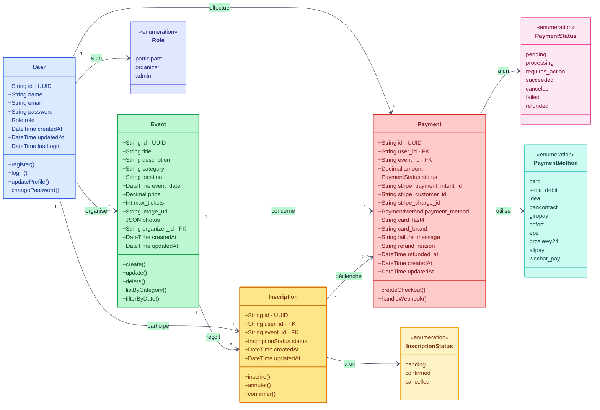
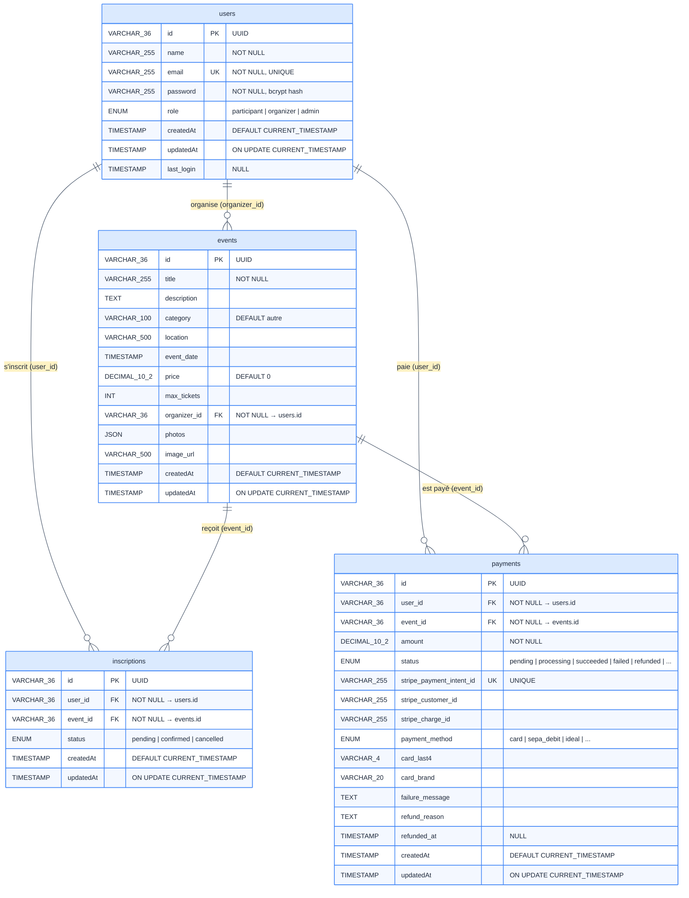
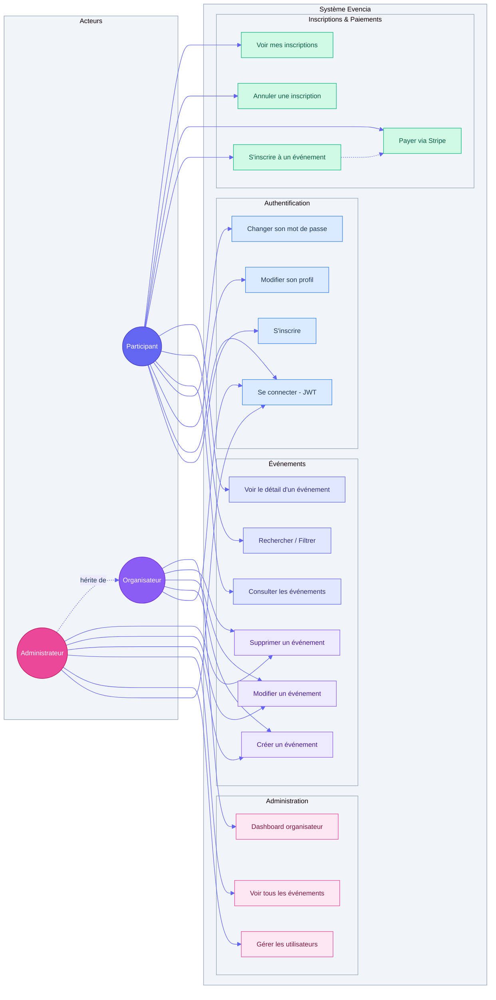
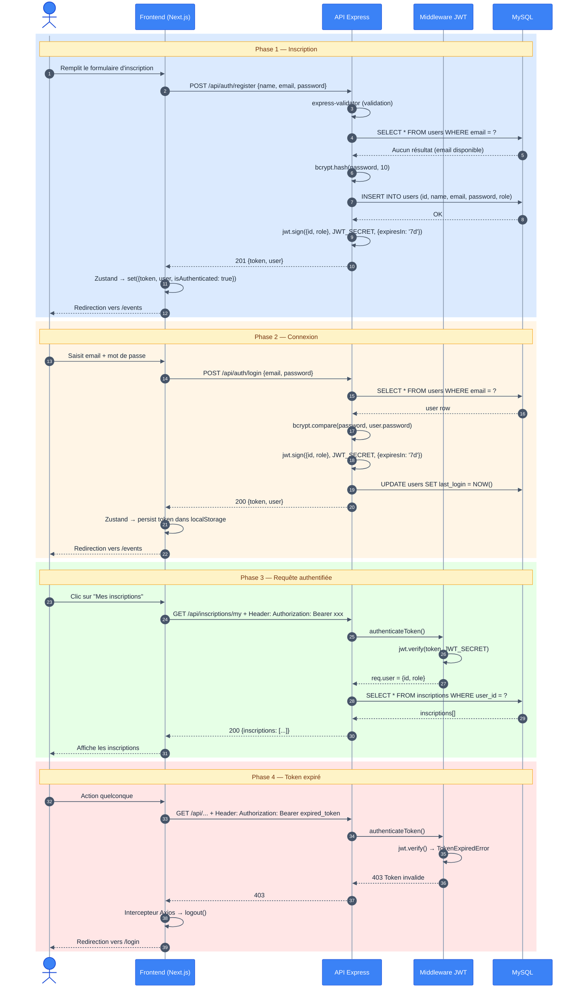
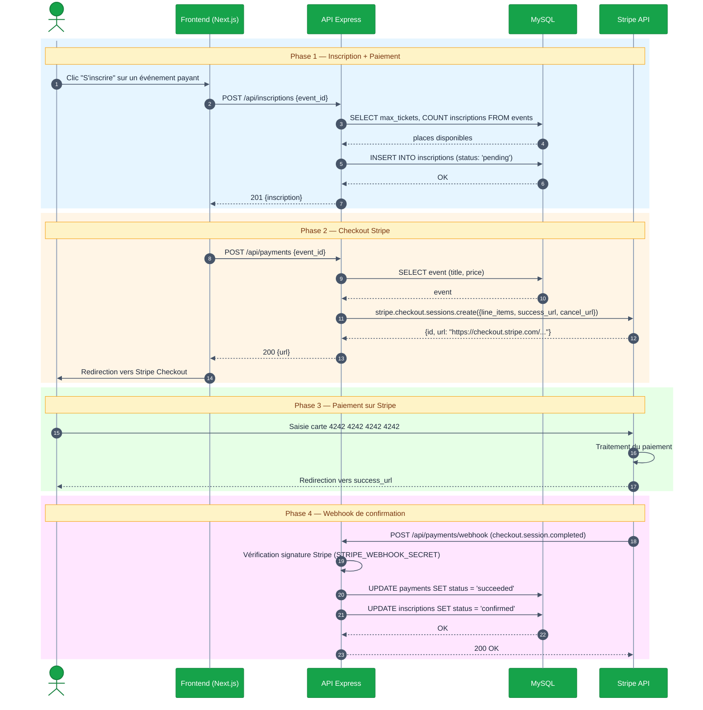
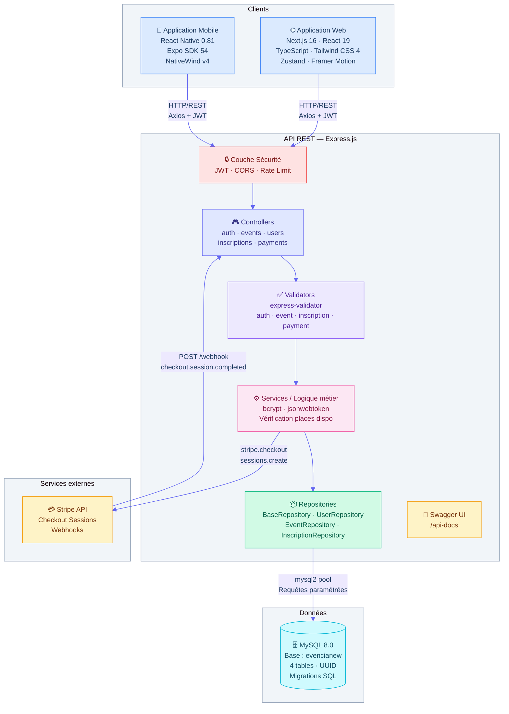
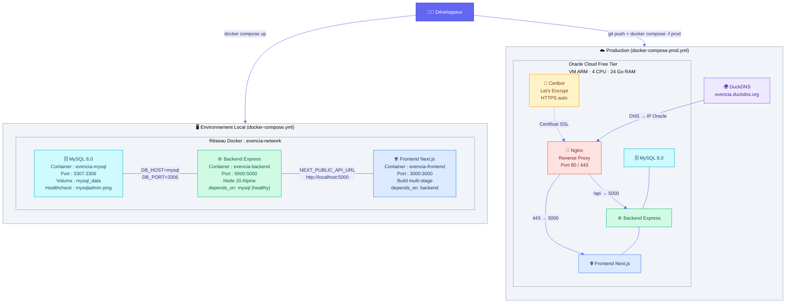
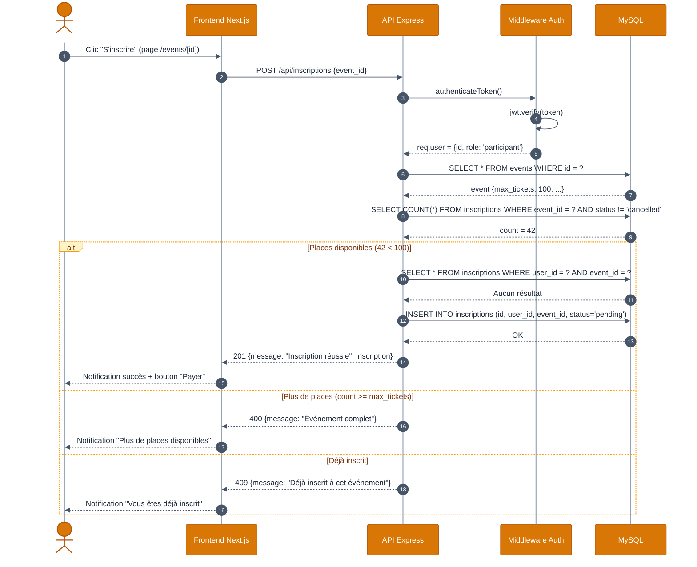
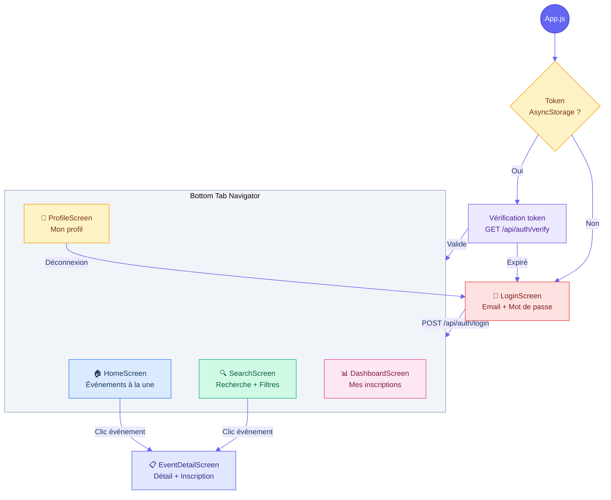
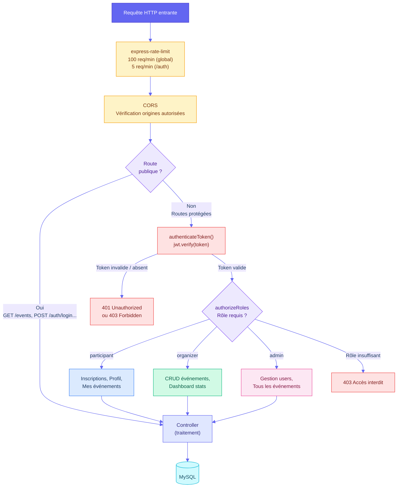

# Épreuves BTS SIO SLAM — Projet Evencia

> Ce document rassemble les informations nécessaires pour remplir les fiches des épreuves **E5** et **E6** du BTS SIO option SLAM, adaptées au projet **Evencia**.

---

## Table des matières

- [Épreuve E5 — Fiche Annexe 9-1-B (Recto)](#épreuve-e5--fiche-annexe-9-1-b-recto)
- [Épreuve E5 — Fiche Annexe 9-1-B (Verso)](#épreuve-e5--fiche-annexe-9-1-b-verso)
- [Épreuve E6 — Parcours de professionnalisation (adapté Evencia)](#épreuve-e6--parcours-de-professionnalisation-adapté-evencia)

---

# Épreuve E5 — Fiche Annexe 9-1-B (Recto)

## Conception et développement d'applications (option SLAM)

### Informations candidat

| Champ | Valeur |
|-------|--------|
| **N° réalisation** | 1 |
| **Nom, prénom** | *(à compléter)* |
| **N° candidat** | *(à compléter)* |
| **Épreuve** | ☑ Épreuve ponctuelle / ☐ Contrôle en cours de formation |
| **Date** | *(à compléter)* |

---

### Organisation support de la réalisation professionnelle

Projet personnel réalisé dans le cadre du BTS SIO option SLAM (2024-2025). Le projet simule une plateforme de gestion d'événements permettant aux organisateurs de créer et gérer des événements, et aux participants de s'y inscrire et de payer en ligne.

---

### Intitulé de la réalisation professionnelle

**Evencia — Application web et mobile fullstack de gestion d'événements**

---

### Période et lieu

| Champ | Valeur |
|-------|--------|
| **Période de réalisation** | Septembre 2024 – Juin 2025 |
| **Lieu** | *(nom de l'établissement / entreprise de stage)* |

---

### Modalité

☑ Seul(e) — ☐ En équipe

---

### Compétences travaillées

| Compétence | Travaillée |
|------------|:----------:|
| **Concevoir et développer une solution applicative** | ☑ |
| **Assurer la maintenance corrective ou évolutive d'une solution applicative** | ☑ |
| **Gérer les données** | ☑ |

---

### Conditions de réalisation (ressources fournies, résultats attendus)

**Contexte :**
Conception et développement d'une application web et mobile de gestion d'événements. L'application doit permettre la création d'événements par des organisateurs, l'inscription et le paiement en ligne par des participants, ainsi qu'un tableau de bord d'administration.

**Ressources fournies :**
- Cahier des charges fonctionnel (gestion multi-rôles : participant, organisateur, administrateur)
- Maquettes et wireframes de l'interface utilisateur
- Accès à un serveur de base de données MySQL 8
- Clés API Stripe (mode test) pour l'intégration des paiements

**Résultats attendus :**
- API RESTful fonctionnelle avec authentification JWT et gestion des rôles
- Interface web responsive (Next.js) avec tableau de bord organisateur
- Application mobile cross-platform (React Native / Expo)
- Base de données relationnelle MySQL avec schéma normalisé
- Documentation interactive de l'API (Swagger / OpenAPI 3)
- Conteneurisation Docker pour le déploiement

---

### Description des ressources documentaires, matérielles et logicielles utilisées

**Environnement de développement :**

| Catégorie | Outils / Technologies |
|-----------|-----------------------|
| **IDE** | Cursor (VS Code), Android Studio |
| **OS** | Arch Linux |
| **Versioning** | Git, GitHub |
| **Conteneurisation** | Docker, Docker Compose |
| **Base de données** | MySQL 8.0 |

**Stack technique :**

| Couche | Technologies |
|--------|-------------|
| **Backend (API)** | Node.js 20, Express.js 4.18, JWT (jsonwebtoken), bcrypt, express-validator, Swagger (swagger-jsdoc + swagger-ui-express), Stripe, express-rate-limit |
| **ORM / BDD** | Drizzle ORM (schémas), mysql2 (requêtes), MySQL 8 |
| **Frontend (Web)** | Next.js 16, React 19, TypeScript, Tailwind CSS 4, Zustand, Framer Motion, Axios, date-fns, Lucide React, @stripe/stripe-js |
| **Frontend (Mobile)** | React Native 0.81, Expo SDK 54, NativeWind v4, React Navigation (Stack + Bottom Tabs), AsyncStorage, Axios |
| **DevOps** | Docker, Docker Compose, Makefile, Nginx (production), Certbot (HTTPS) |
| **Tests** | Postman, Swagger UI |
| **Déploiement** | Oracle Cloud (VPS ARM), DuckDNS (sous-domaine gratuit) |

**Ressources documentaires :**
- Documentation officielle : Next.js, Express.js, React Native, Expo, Drizzle ORM, Stripe
- Référentiel BTS SIO option SLAM
- MDN Web Docs (JavaScript, API Web)

---

### Modalités d'accès aux productions et à leur documentation

| Élément | Accès |
|---------|-------|
| **Dépôt GitHub** | `https://github.com/Noblesse18/evencia` |
| **Documentation API (Swagger)** | `http://localhost:5000/api-docs` (local) ou `https://evencia.duckdns.org/api-docs` (prod) |
| **Frontend** | `http://localhost:3000` (local) ou `https://evencia.duckdns.org` (prod) |
| **Lancement Docker** | `docker compose up --build -d` à la racine du projet |
| **Documentation projet** | Dossier `docs/` du dépôt (TPs, guides de déploiement, Stripe) |

**Comptes de test :**

| Rôle | Email | Mot de passe |
|------|-------|-------------|
| Administrateur | admin@evencia.fr | Evencia2026! |
| Organisateur | organisateur@evencia.fr | Evencia2026! |
| Participant | participant@evencia.fr | Evencia2026! |

**Carte de test Stripe :** `4242 4242 4242 4242` (date future quelconque, CVC quelconque)

---

---

# Épreuve E5 — Fiche Annexe 9-1-B (Verso)

## Descriptif de la réalisation professionnelle

---

### 1. Contexte et objectifs

Dans le cadre du BTS SIO option SLAM, j'ai conçu et développé **Evencia**, une application fullstack de gestion d'événements. L'objectif était de créer une plateforme complète permettant :

- Aux **organisateurs** de créer, modifier et supprimer des événements, et de suivre les inscriptions via un tableau de bord
- Aux **participants** de parcourir les événements, s'inscrire, payer en ligne (Stripe) et gérer leur profil
- Aux **administrateurs** de superviser l'ensemble des utilisateurs et événements

L'application se compose de trois parties : une **API REST** (Express.js), une **interface web** (Next.js) et une **application mobile** (React Native / Expo), le tout orchestré par **Docker Compose**.

---

### 2. Architecture globale

```
┌──────────────────────────────────────────────────────────────────┐
│                        Client / Utilisateur                      │
│                                                                  │
│   ┌──────────────────┐    ┌──────────────────────────────────┐  │
│   │  Application      │    │  Application Web                 │  │
│   │  Mobile (Expo)    │    │  Next.js 16 + TypeScript         │  │
│   │  React Native     │    │  Tailwind CSS 4 + Framer Motion  │  │
│   │  NativeWind       │    │  Zustand (state) + Axios         │  │
│   └────────┬─────────┘    └──────────────┬───────────────────┘  │
│            │          HTTP / REST          │                      │
└────────────┼──────────────────────────────┼──────────────────────┘
             │                              │
             ▼                              ▼
┌──────────────────────────────────────────────────────────────────┐
│                     API REST — Express.js                         │
│                                                                  │
│  ┌─────────────┐  ┌────────────┐  ┌──────────────────────────┐  │
│  │ Middleware   │  │ Controllers│  │ Services / Validators    │  │
│  │ JWT + Roles  │  │ (5 modules)│  │ express-validator        │  │
│  │ Rate Limit   │  │            │  │ bcrypt · jsonwebtoken    │  │
│  │ CORS         │  │            │  │                          │  │
│  └──────┬──────┘  └─────┬──────┘  └────────────┬─────────────┘  │
│         │               │                       │                │
│         ▼               ▼                       ▼                │
│  ┌──────────────────────────────────────────────────────────┐    │
│  │           Repositories + mysql2 (pool)                   │    │
│  │           Drizzle ORM (schémas)                          │    │
│  └────────────────────────┬─────────────────────────────────┘    │
│                           │                                      │
│  ┌────────────────┐       │       ┌──────────────────────────┐   │
│  │ Swagger UI     │       │       │ Stripe API               │   │
│  │ /api-docs      │       │       │ Checkout + Webhooks      │   │
│  └────────────────┘       │       └──────────────────────────┘   │
└───────────────────────────┼──────────────────────────────────────┘
                            │
                            ▼
                 ┌─────────────────────┐
                 │   MySQL 8.0         │
                 │   Base : evencianew │
                 │   (Docker volume)   │
                 └─────────────────────┘
```

---

### 3. Schéma de la base de données

```
┌──────────────────────────┐       ┌──────────────────────────────────┐
│         users            │       │           events                 │
├──────────────────────────┤       ├──────────────────────────────────┤
│ id         VARCHAR(36) PK│       │ id           VARCHAR(36) PK     │
│ name       VARCHAR(100)  │       │ title        VARCHAR(200)       │
│ email      VARCHAR(100) U│       │ description  TEXT               │
│ password   VARCHAR(255)  │       │ category     VARCHAR(100)       │
│ role       ENUM(particip │       │ location     VARCHAR(200)       │
│   ant,organizer,admin)   │       │ event_date   DATETIME           │
│ created_at TIMESTAMP     │◄──────│ organizer_id VARCHAR(36) FK     │
│ updated_at TIMESTAMP     │       │ price        DECIMAL(10,2)      │
│ last_login TIMESTAMP     │       │ max_tickets  INT                │
└──────────┬───────────────┘       │ image_url    VARCHAR(500)       │
           │                       │ photos       JSON               │
           │                       │ created_at   TIMESTAMP          │
           │                       │ updated_at   TIMESTAMP          │
           │                       └──────────────┬───────────────────┘
           │                                      │
           │    ┌─────────────────────────┐       │
           │    │     inscriptions        │       │
           │    ├─────────────────────────┤       │
           │    │ id        VARCHAR(36) PK│       │
           └───►│ user_id   VARCHAR(36) FK│       │
                │ event_id  VARCHAR(36) FK│◄──────┘
                │ status    ENUM(pending, │
                │   confirmed, cancelled) │
                │ created_at TIMESTAMP    │
                │ updated_at TIMESTAMP    │
                │ UNIQUE(user_id,event_id)│
                └─────────┬───────────────┘
                          │
           ┌──────────────┘
           │
           │    ┌──────────────────────────────────┐
           │    │         payments                  │
           │    ├──────────────────────────────────┤
           │    │ id                    VARCHAR(36) │
           │    │ user_id               VARCHAR(36) │
           │    │ event_id              VARCHAR(36) │
           │    │ amount                DECIMAL     │
           │    │ status                VARCHAR     │
           │    │ stripe_payment_intent VARCHAR     │
           │    │ stripe_customer_id    VARCHAR     │
           │    │ payment_method        VARCHAR     │
           │    │ card_last4            VARCHAR(4)  │
           │    │ card_brand            VARCHAR     │
           │    └──────────────────────────────────┘
```

**Relations :**
- `users` 1 ↔ N `events` (un organisateur crée plusieurs événements)
- `users` 1 ↔ N `inscriptions` (un utilisateur s'inscrit à plusieurs événements)
- `events` 1 ↔ N `inscriptions` (un événement a plusieurs inscrits)
- `inscriptions` 1 ↔ 1 `payments` (une inscription peut avoir un paiement)

---

### 4. Diagramme de cas d'utilisation

```
┌───────────────────────────────────────────────────────────────┐
│               Système Evencia                                 │
│                                                               │
│   ┌─────────────────────┐  ┌─────────────────────────────┐   │
│   │ S'inscrire          │  │ Créer un événement          │   │
│   │ (register)          │  │ (titre, date, lieu, prix,   │   │
│   └─────────┬───────────┘  │  catégorie, places max)     │   │
│             │              └──────────────┬──────────────┘   │
│   ┌─────────┴───────────┐  ┌─────────────┴──────────────┐   │
│   │ Se connecter        │  │ Modifier un événement       │   │
│   │ (JWT)               │  └──────────────┬──────────────┘   │
│   └─────────┬───────────┘  ┌─────────────┴──────────────┐   │
│             │              │ Supprimer un événement      │   │
│   ┌─────────┴───────────┐  └──────────────┬──────────────┘   │
│   │ Voir les événements │  ┌─────────────┴──────────────┐   │
│   │ (filtres, recherche)│  │ Dashboard organisateur      │   │
│   └─────────┬───────────┘  │ (stats inscriptions)        │   │
│             │              └─────────────────────────────┘   │
│   ┌─────────┴───────────┐                                    │
│   │ S'inscrire à un     │  ┌─────────────────────────────┐   │
│   │ événement           │  │ Gérer les utilisateurs      │   │
│   └─────────┬───────────┘  │ (liste, rôles)              │   │
│             │              └──────────────┬──────────────┘   │
│   ┌─────────┴───────────┐               │                    │
│   │ Payer (Stripe)      │               │                    │
│   └─────────┬───────────┘               │                    │
│             │                            │                    │
│   ┌─────────┴───────────┐               │                    │
│   │ Annuler inscription │               │                    │
│   └─────────┬───────────┘               │                    │
│             │                            │                    │
│   ┌─────────┴───────────┐               │                    │
│   │ Modifier son profil │               │                    │
│   │ Changer mot de passe│               │                    │
│   └─────────────────────┘               │                    │
│             │                            │                    │
└─────────────┼────────────────────────────┼────────────────────┘
              │                            │
        ┌─────┴──────┐            ┌────────┴────────┐
        │ Participant │            │ Organisateur /  │
        │             │            │ Administrateur  │
        └────────────┘            └─────────────────┘
```

---

### 5. Endpoints de l'API REST

#### Authentification (`/api/auth`)

| Méthode | Endpoint | Description | Rôle |
|---------|----------|-------------|------|
| POST | `/api/auth/register` | Inscription d'un utilisateur | Public |
| POST | `/api/auth/login` | Connexion, retour JWT | Public |
| GET | `/api/auth/verify` | Vérification du token JWT | Authentifié |
| POST | `/api/auth/change-password` | Changement de mot de passe | Authentifié |
| POST | `/api/auth/request-password-reset` | Demande de réinitialisation | Public |
| POST | `/api/auth/reset-password` | Réinitialisation du mot de passe | Public |

#### Utilisateurs (`/api/users`)

| Méthode | Endpoint | Description | Rôle |
|---------|----------|-------------|------|
| GET | `/api/users/me` | Profil de l'utilisateur connecté | Authentifié |
| PUT | `/api/users/me` | Modifier son profil | Authentifié |
| GET | `/api/users/` | Liste de tous les utilisateurs | Admin |
| GET | `/api/users/:id` | Détail d'un utilisateur | Admin |

#### Événements (`/api/events`)

| Méthode | Endpoint | Description | Rôle |
|---------|----------|-------------|------|
| GET | `/api/events` | Lister les événements (filtres, pagination) | Public |
| GET | `/api/events/:id` | Détail d'un événement | Public |
| GET | `/api/events/categories` | Liste des catégories | Public |
| GET | `/api/events/organizer/my-events` | Événements de l'organisateur connecté | Organizer |
| POST | `/api/events` | Créer un événement | Organizer / Admin |
| PUT | `/api/events/:id` | Modifier un événement | Organizer / Admin |
| DELETE | `/api/events/:id` | Supprimer un événement | Organizer / Admin |

#### Inscriptions (`/api/inscriptions`)

| Méthode | Endpoint | Description | Rôle |
|---------|----------|-------------|------|
| GET | `/api/inscriptions/my` | Mes inscriptions | Authentifié |
| POST | `/api/inscriptions` | S'inscrire à un événement | Participant |
| DELETE | `/api/inscriptions/:id` | Annuler une inscription | Participant |

#### Paiements (`/api/payments`)

| Méthode | Endpoint | Description | Rôle |
|---------|----------|-------------|------|
| POST | `/api/payments` | Créer une session Stripe Checkout | Authentifié |
| POST | `/api/payments/webhook` | Webhook Stripe (confirmation) | Stripe |

---

### 6. Sécurité et authentification

**Flux d'authentification JWT :**

```
Utilisateur                    API Express                    MySQL
    │                              │                            │
    │── POST /api/auth/login ─────►│                            │
    │   { email, password }        │── SELECT user WHERE email ►│
    │                              │◄── user row ───────────────│
    │                              │                            │
    │                              │ bcrypt.compare(password,   │
    │                              │   user.password)           │
    │                              │                            │
    │                              │ jwt.sign({ id, role },     │
    │                              │   JWT_SECRET, { 7d })      │
    │                              │                            │
    │◄── { token, user } ─────────│                            │
    │                              │                            │
    │── GET /api/events ──────────►│                            │
    │   Authorization: Bearer xxx  │                            │
    │                              │ authenticateToken()        │
    │                              │ jwt.verify(token, secret)  │
    │                              │                            │
    │                              │ authorizeRoles('organizer')│
    │                              │ req.user.role check        │
    │                              │                            │
    │◄── { events: [...] } ───────│                            │
```

**Mesures de sécurité implémentées :**

| Mesure | Implémentation |
|--------|---------------|
| Hashage des mots de passe | bcrypt avec salt factor 10 |
| Authentification | JWT avec expiration 7 jours |
| Autorisation par rôles | Middleware `authorizeRoles('participant', 'organizer', 'admin')` |
| Validation des entrées | express-validator (`@NotBlank`, `@Email`, longueur min/max) |
| Protection brute force | express-rate-limit (100 req/min global, 5 req/min sur `/auth`) |
| CORS | Origines restreintes via `CORS_ORIGINS` |
| Interception token expiré | Intercepteur Axios côté frontend (déconnexion auto sur 401) |

---

### 7. Interface utilisateur (Frontend Next.js)

**Pages principales :**

| Page | Route | Description |
|------|-------|-------------|
| Accueil | `/` | Présentation, événements mis en avant |
| Connexion | `/login` | Formulaire de connexion |
| Inscription | `/register` | Formulaire d'inscription |
| Événements | `/events` | Liste avec filtres (catégorie, date, prix, ville), pagination |
| Détail événement | `/events/[id]` | Informations complètes, inscription, paiement |
| Création événement | `/events/create` | Formulaire de création (organizer/admin) |
| Édition événement | `/events/[id]/edit` | Modification (organizer/admin) |
| Profil | `/profile` | Consultation et modification du profil |
| Dashboard | `/dashboard` | Tableau de bord organisateur (stats) |
| Administration | `/admin` | Gestion des utilisateurs (admin) |

**Technologies UI :**
- **Tailwind CSS 4** : design responsive et moderne
- **Framer Motion** : animations fluides (transitions de pages, apparitions)
- **Zustand** : gestion d'état centralisée avec persistance (localStorage)
- **Lucide React** : bibliothèque d'icônes

---

### 8. Application mobile (React Native / Expo)

**Écrans :**

| Écran | Description |
|-------|-------------|
| LoginScreen | Connexion utilisateur |
| HomeScreen | Accueil avec événements |
| SearchScreen | Recherche et filtres d'événements |
| EventDetailScreen | Détail d'un événement + inscription |
| DashboardScreen | Tableau de bord |
| ProfileScreen | Profil utilisateur |

**Architecture mobile :**
- **AuthContext** : gestion de l'authentification (login, logout, token AsyncStorage)
- **React Navigation** : Stack Navigator + Bottom Tab Navigator
- **Client API Axios** : base URL `10.0.2.2:5000/api` (émulateur) avec intercepteur JWT
- **NativeWind v4** : Tailwind CSS pour React Native

---

### 9. Conteneurisation Docker

```yaml
# docker-compose.yml — 3 services
services:
  mysql:      # MySQL 8.0, port 3307, volume persistant, migrations auto
  backend:    # Node 20 Alpine, port 5000, dépend de mysql (healthcheck)
  frontend:   # Next.js 16 (build multi-stage), port 3000
```

**Points techniques :**
- Les migrations SQL sont exécutées automatiquement au démarrage de MySQL via `/docker-entrypoint-initdb.d`
- Le backend attend que MySQL soit healthy avant de démarrer (`depends_on: condition: service_healthy`)
- Le frontend utilise un build multi-stage (deps → build → runner) pour une image optimisée
- Un `docker-compose.prod.yml` existe pour le déploiement avec Nginx et Certbot (HTTPS)

---

### 10. Extraits de code significatifs

#### Middleware d'authentification JWT

```javascript
// backend/src/middleware/auth.js
const authenticateToken = (req, res, next) => {
    const authHeader = req.headers['authorization'];
    const token = authHeader && authHeader.split(' ')[1];
    if (!token) return res.status(401).json({ message: 'Token manquant' });

    jwt.verify(token, process.env.JWT_SECRET, (err, user) => {
        if (err) return res.status(403).json({ message: 'Token invalide' });
        req.user = user;
        next();
    });
};

function authorizeRoles(...allowedRoles) {
    return (req, res, next) => {
        if (!allowedRoles.includes(req.user.role)) {
            return res.status(403).json({ message: 'Accès interdit' });
        }
        next();
    };
}
```

#### Validation avec express-validator

```javascript
// backend/src/validators/authValidator.js
const validateRegister = [
    body('name').trim().notEmpty().withMessage('Le nom est requis'),
    body('email').isEmail().withMessage('Email invalide'),
    body('password')
        .isLength({ min: 8 })
        .matches(/^(?=.*[a-z])(?=.*[A-Z])(?=.*\d)/)
        .withMessage('8 caractères min, 1 majuscule, 1 minuscule, 1 chiffre'),
];
```

#### Store Zustand (frontend)

```typescript
// frontend/src/store/authStore.ts
export const useAuthStore = create<AuthState>()(
    persist(
        (set) => ({
            user: null,
            token: null,
            isAuthenticated: false,
            login: async (email, password) => {
                const { data } = await authAPI.login({ email, password });
                set({ user: data.user, token: data.token, isAuthenticated: true });
            },
            logout: () => set({ user: null, token: null, isAuthenticated: false }),
        }),
        { name: 'auth-storage' }
    )
);
```

#### Paiement Stripe (backend)

```javascript
// backend/src/controllers/paymentController.js
const createCheckoutSession = async (req, res) => {
    const session = await stripe.checkout.sessions.create({
        payment_method_types: ['card'],
        line_items: [{ price_data: { currency: 'eur', product_data: { name: event.title }, unit_amount: event.price * 100 }, quantity: 1 }],
        mode: 'payment',
        success_url: `${process.env.FRONTEND_URL}/events/${eventId}?payment=success`,
        cancel_url: `${process.env.FRONTEND_URL}/events/${eventId}?payment=cancel`,
    });
    res.json({ url: session.url });
};
```

---

### 11. Compétences mises en œuvre (référentiel BTS SIO SLAM)

| Compétence du référentiel | Mise en œuvre dans Evencia |
|---------------------------|---------------------------|
| **Concevoir une solution applicative** | Architecture en couches (Controllers → Services → Repositories → MySQL), API REST, diagrammes UML |
| **Développer des composants métier** | Controllers Express (auth, events, inscriptions, payments), middleware JWT, validators |
| **Développer des composants d'accès aux données** | Repositories (BaseRepository, UserRepository, EventRepository), requêtes SQL paramétrées, Drizzle ORM |
| **Développer la présentation d'une solution applicative** | Interface Next.js responsive, composants React réutilisables (Button, Card, Input), application mobile Expo |
| **Intégrer des composants applicatifs** | Communication Frontend ↔ Backend via Axios, intégration Stripe, Docker Compose multi-services |
| **Gérer les données** | Schéma MySQL normalisé, migrations SQL, UUIDs, contraintes d'intégrité (UNIQUE, FK) |
| **Protéger les données à caractère personnel** | Hashage bcrypt, JWT, CORS, rate limiting, validation des entrées |
| **Assurer la maintenance corrective ou évolutive** | Ajout de catégories, tickets max, paiements Stripe, application mobile (évolutions) |
| **Documenter une solution applicative** | Swagger/OpenAPI 3 (`/api-docs`), README, guide de déploiement, TPs documentés |

---

---

# Épreuve E6 — Parcours de professionnalisation (adapté Evencia)

> Ci-dessous, le contenu adapté au projet Evencia pour l'épreuve E6 (même structure que le document E6_Slam_Filled.pdf mais avec la stack réelle du projet).

---

## 1. Contexte du projet

Dans le cadre du BTS SIO option SLAM, j'ai développé **Evencia**, une application fullstack de gestion d'événements. L'objectif était de concevoir une plateforme complète (web + mobile) intégrant authentification sécurisée, gestion des rôles, paiement en ligne et déploiement conteneurisé.

L'application gère trois rôles distincts :
- **Participant** : inscription, connexion, consultation et recherche d'événements, inscription/désinscription, paiement Stripe, modification du profil
- **Organisateur** : CRUD complet sur ses événements, tableau de bord avec statistiques d'inscriptions
- **Administrateur** : gestion de tous les utilisateurs et événements

La stack technique retenue est : **Node.js 20, Express.js, MySQL 8, Drizzle ORM, JWT, Swagger/OpenAPI 3, Next.js 16, TypeScript, Tailwind CSS 4, Zustand, React Native Expo SDK 54, Docker Compose, Stripe**.

---

## 2. Architecture Back-end — Schéma des couches

```
Client / Frontend
  Next.js · React Native · Postman

         │ HTTP / REST
         ▼
┌─────────────────────────────────────────────────┐
│           Couche Sécurité                       │
│  authenticateToken (JWT verify)                  │
│  authorizeRoles('participant','organizer','admin')│
│  express-rate-limit (100/min, 5/min auth)        │
│  CORS (origines configurables)                   │
├─────────────────────────────────────────────────┤
│           Couche Controller                     │
│  @RestController équivalent                     │
│  authController · eventController               │
│  userController · inscriptionController         │
│  paymentController                              │
├─────────────────────────────────────────────────┤
│           Couche Validation                     │
│  express-validator                              │
│  authValidator · eventValidator                 │
│  inscriptionValidator · paymentValidator        │
├─────────────────────────────────────────────────┤
│           Couche Service / Logique métier       │
│  Inscription avec vérification places dispo     │
│  Création Checkout Session Stripe               │
│  Hashage bcrypt · Génération JWT                │
├─────────────────────────────────────────────────┤
│           Couche Repository                     │
│  BaseRepository · UserRepository                │
│  EventRepository · InscriptionRepository        │
│  mysql2 pool · Requêtes paramétrées             │
├─────────────────────────────────────────────────┤
│           Couche Données                        │
│  MySQL 8.0 · Base evencianew                    │
│  Drizzle ORM (schémas)                          │
│  Migrations SQL auto (Docker init)              │
└─────────────────────────────────────────────────┘

  Swagger UI : /api-docs (documentation interactive)
```

---

## 3. Diagramme de classes (UML)

```
┌──────────────────────┐
│      «Entity»        │
│        User          │
├──────────────────────┤
│ - id : UUID          │
│ - name : String      │
│ - email : String     │
│ - password : String  │
│ - role : Role        │
│ - last_login : Date  │
├──────────────────────┤
│ + register()         │
│ + login()            │
│ + updateProfile()    │
│ + changePassword()   │
└──────┬──────┬────────┘
       │      │
       │      │ 1..*
       │      ▼
       │  ┌──────────────────────────┐
       │  │      «Entity»            │
       │  │     Inscription          │
       │  ├──────────────────────────┤
       │  │ - id : UUID              │
       │  │ - user : User            │
       │  │ - event : Event          │
       │  │ - status : InscriptionSt │
       │  │ - created_at : Date      │
       │  ├──────────────────────────┤
       │  │ + inscrire()             │
       │  │ + annuler()              │
       │  └──────────┬───────────────┘
       │             │
       │  1..*       │ 1..*
       ▼             ▼
┌──────────────────────────┐     ┌───────────────────┐
│      «Entity»            │     │ «Enum» Role       │
│       Event              │     ├───────────────────┤
├──────────────────────────┤     │ participant       │
│ - id : UUID              │     │ organizer         │
│ - title : String         │     │ admin             │
│ - description : Text     │     └───────────────────┘
│ - category : String      │
│ - location : String      │     ┌───────────────────┐
│ - event_date : DateTime  │     │ «Enum»            │
│ - price : Decimal        │     │ InscriptionStatus │
│ - max_tickets : Int      │     ├───────────────────┤
│ - image_url : String     │     │ pending           │
│ - organizer : User       │     │ confirmed         │
├──────────────────────────┤     │ cancelled         │
│ + create()               │     └───────────────────┘
│ + update()               │
│ + delete()               │     ┌───────────────────┐
│ + listByCategory()       │     │ «Entity» Payment  │
└──────────────────────────┘     ├───────────────────┤
                                 │ - id : UUID       │
                                 │ - user : User     │
                                 │ - event : Event   │
                                 │ - amount : Decimal│
                                 │ - status : String │
                                 │ - stripe_id : Str │
                                 └───────────────────┘
```

---

## 4. Documentation Swagger / OpenAPI 3

Accessible à : `http://localhost:5000/api-docs`

```
EventManagement API — OAS 3.0 — v1.0.0

▸ auth-controller
  POST /api/auth/register         Inscription utilisateur
  POST /api/auth/login            Connexion + retour JWT
  GET  /api/auth/verify           Vérification token
  POST /api/auth/change-password  Changement mot de passe

▸ event-controller
  GET    /api/events              Lister (filtres, pagination)
  GET    /api/events/:id          Détail événement
  GET    /api/events/categories   Catégories disponibles
  POST   /api/events              [ORGANIZER/ADMIN] Créer
  PUT    /api/events/:id          [ORGANIZER/ADMIN] Modifier
  DELETE /api/events/:id          [ORGANIZER/ADMIN] Supprimer

▸ user-controller
  GET /api/users/me               Mon profil
  PUT /api/users/me               Modifier profil

▸ inscription-controller
  GET    /api/inscriptions/my     Mes inscriptions
  POST   /api/inscriptions        S'inscrire
  DELETE /api/inscriptions/:id    Annuler

▸ payment-controller
  POST /api/payments              Checkout Stripe
  POST /api/payments/webhook      Webhook Stripe
```

Le bouton **Authorize** permet de saisir le token JWT (`Bearer <token>`) pour tester les endpoints protégés directement depuis l'interface Swagger.

---

## 5. Déploiement

**Environnement local :** Docker Compose (MySQL + Backend + Frontend) — `docker compose up --build -d`

**Environnement de production :**
- **Hébergement** : Oracle Cloud Free Tier (VM ARM, 4 CPU, 24 Go RAM)
- **Reverse proxy** : Nginx
- **HTTPS** : Certbot (Let's Encrypt)
- **Domaine** : `evencia.duckdns.org` (sous-domaine DuckDNS gratuit)
- **Orchestration** : `docker-compose.prod.yml` avec services MySQL, Backend, Frontend, Nginx, Certbot

---

## 6. Récapitulatif des technologies

| Couche | Technologies |
|--------|-------------|
| **Backend** | Node.js 20 · Express.js 4.18 · JWT · bcrypt · express-validator · express-rate-limit · Swagger/OpenAPI 3 · Stripe |
| **Base de données** | MySQL 8.0 · Drizzle ORM (schémas) · mysql2 (requêtes) · Migrations SQL |
| **Frontend Web** | Next.js 16 · React 19 · TypeScript · Tailwind CSS 4 · Zustand · Framer Motion · Axios · @stripe/stripe-js |
| **Frontend Mobile** | React Native 0.81 · Expo SDK 54 · NativeWind v4 · React Navigation · AsyncStorage · Axios |
| **DevOps** | Docker · Docker Compose · Makefile · Nginx · Certbot · Oracle Cloud |

---

*Projet réalisé dans le cadre des épreuves E5 et E6 · BTS SIO SLAM · 2024-2025 · Node.js · Express · Next.js 16 · MySQL 8 · JWT · Swagger/OpenAPI 3 · React Native Expo · Docker · Stripe*

---

---

# Diagrammes Mermaid (UML)

> Les diagrammes ci-dessous sont en syntaxe **Mermaid** et se rendent automatiquement sur GitHub, GitLab, Notion, ou tout éditeur Markdown compatible. Pour un rendu local, utiliser l'extension VS Code « Markdown Preview Mermaid Support » ou le site [mermaid.live](https://mermaid.live).

> **Thème coloré inclus** : chaque diagramme contient une directive `%%{init}%%` qui applique automatiquement les couleurs. Il suffit de copier-coller le bloc entier (y compris la première ligne `%%{init...}%%`) sur [mermaid.live](https://mermaid.live) pour obtenir un rendu coloré.

---

## 1. Diagramme de classes UML



---

## 2. Diagramme entité-relation (base de données)



---

## 3. Diagramme de cas d'utilisation



---

## 4. Diagramme de séquence — Authentification JWT



---

## 5. Diagramme de séquence — Paiement Stripe



---

## 6. Diagramme d'architecture globale



---

## 7. Diagramme de déploiement Docker



---

## 8. Diagramme de séquence — Inscription à un événement



---

## 9. Diagramme de navigation — Application Mobile (Expo)



---

## 10. Diagramme de flux — Gestion des rôles et autorisations


